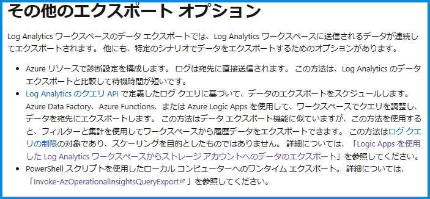

こんにちは、Azure Monitoring サポート チームの北村です。
Log Analytics ワークスペースのデータ エクスポートという機能をご存知でしょうか。
この機能では Log Analytics ワークスペースのログをストレージ アカウントやイベント ハブにエクスポートすることができます。
今回はこのデータ エクスポート機能でよくお問い合わせをいただくご質問を紹介いたします。

 

<!-- more -->
## Q & A タイトル
- [Q1. データ エクスポート機能は全てのテーブルでサポートされていますか。](#Q1-データ-エクスポート機能は全てのテーブルでサポートされていますか。)
- [Q2. ストレージ アカウントやイベント ハブにデータがエクスポートされる契機を教えてください。](#Q2-ストレージ-アカウントやイベント-ハブにデータがエクスポートされる契機を教えてください。)
- [Q3. データ エクスポート ルールの作成前に収集されたログは、ストレージ アカウントやイベント ハブにエクスポートされますか。](#Q3-データ-エクスポート-ルールの作成前に収集されたログは、ストレージ-アカウントやイベント-ハブにエクスポートされますか。)
- [Q4. ログがストレージ アカウントに転送されていません。考えられる原因を教えてください。](#Q4-ログがストレージ-アカウントに転送されていません。考えられる原因を教えてください。)
- [Q5. Log Analytics ワークスペースにログが収集され、ある一定期間経過したデータをストレージ アカウントに転送したいです。](#Q5-Log-Analytics-ワークスペースにログが収集され、ある一定期間経過したデータをストレージ-アカウントに転送したいです。)
- [Q6. データ エクスポート機能でサポートしていないテーブルのログをストレージ アカウントに転送したいです。代替案を教えてください。](#Q6-データ-エクスポート機能でサポートしていないテーブルのログをストレージ-アカウントに転送したいです。代替案を教えてください。)
- [Q7. データ エクスポート機能でストレージ アカウントにログをエクスポートするように設定しました。エクスポートしたログを確認する方法を教えてください。](#Q7-データ-エクスポート機能でストレージ-アカウントにログをエクスポートするように設定しました。エクスポートしたログを確認する方法を教えてください。)
- [Q8. サポートされていないテーブルも含めてデータ エクスポート ルールを設定してしまいました。エクスポート ルールを再作成した方が良いですか。](#Q8-サポートされていないテーブルも含めてデータ-エクスポート-ルールを設定してしまいました。エクスポート-ルールを再作成した方が良いですか。)
- [Q9. 既存のエクスポート ルールの宛先と同じストレージ アカウントを指定し、新規にエクスポート ルールを作成しようしましたが、エラーが発生しました。](#Q9-既存のエクスポート-ルールの宛先と同じストレージ-アカウントを指定し、新規にエクスポート-ルールを作成しようしましたが、エラーが発生しました。)
- [Q10. ストレージ アカウントにデータをエクスポートするように設定しています。データ エクスポート機能の利用料金を教えてください。](#Q10-ストレージ-アカウントにデータをエクスポートするように設定しています。データ-エクスポート機能の利用料金を教えてください。)

 

### Q1. データ エクスポート機能は全てのテーブルでサポートされていますか。
いいえ、全てのテーブルでサポートしておりません。
サポート対象のテーブルは、[こちら](https://learn.microsoft.com/ja-jp/azure/azure-monitor/logs/logs-data-export?tabs=portal#supported-tables)の公開情報をご参照ください。

 

### Q2. ストレージ アカウントやイベント ハブにデータがエクスポートされる契機を教えてください。
データ エクスポート機能は Log Analytics ワークスペースへの "取り込み時" に指定したエクスポート先 (ストレージ アカウントやイベント ハブ) へデータをエクスポートします。
Log Analytics ワークスペースのログを ストレージ アカウントにエクスポートした場合は 5 分単位でファイルが作成されます。
ログの書き込みは 5 分ごとにまとめて行われるのではなく、対象のレコードが生成される度にストレージ アカウントのファイルに追記されます。詳細は[弊社公開情報](https://learn.microsoft.com/ja-jp/azure/azure-monitor/logs/logs-data-export?tabs=portal#overview) もご覧いただけますと幸いです。

 

### Q3. データ エクスポート ルールの作成前に収集されたログは、ストレージ アカウントやイベント ハブにエクスポートされますか。
いいえ、エクスポートされません。
データ エクスポート機能は、Log Analytics ワークスペースへの "取り込み時" に指定したエクスポート先 (ストレージ アカウント等) へ転送する機能です。そのため、データ エクスポート ルールの設定前に既に取り込まれたログの転送は行われず、コンテナも作成されません。

 

### Q4. ログがストレージ アカウントに転送されていません。考えられる原因を教えてください。
データ エクスポート ルールの作成後に、Log Analytics ワークスペースにログが収集されていない可能性がございます。
Log Analytics ワークスペース上でクエリを実行いただき、エクスポート対象のログがデータ エクスポート ルールの作成後に収集されているかどうかをご確認ください。
データ エクスポート ルールの作成後にログが収集されているにも関わらず、ストレージ アカウントにログがエクスポートされていない場合は弊社サポート窓口までお問い合わせください。

 

### Q5. Log Analytics ワークスペースにログが収集され、ある一定期間経過したデータをストレージ アカウントに転送したいです。
大変恐縮ではございますが、データ エクスポート機能では、ある一定期間を経過したログを転送する設定はできません。
過去に遡ってログをエクスポートすることや特定期間のログをエクスポートすることはできません。
過去のログや特定の期間におけるログをエクスポートされたい場合は、お客様にてストレージ アカウントにアップロードするような仕組みをご構成いただくことをご検討ください。

 

### Q6. データ エクスポート機能でサポートしていないテーブルのログをストレージ アカウントに転送したいです。代替案を教えてください。
エクスポートしたいログ データの種類によります。
例えば [Azure アクティビティ ログ](https://learn.microsoft.com/ja-jp/azure/azure-monitor/essentials/diagnostic-settings#activity-log-settings)や[診断設定](https://learn.microsoft.com/ja-jp/azure/azure-monitor/essentials/diagnostic-settings)のデータは診断設定側でストレージ アカウントに転送することが可能です。エクスポートしたいログ データが Azure アクティビティ ログや診断設定によるデータ以外の場合は、Azure Functions や Azure Logic Apps 等を使用して、データをストレージ アカウントにエクスポートする方法や、お客様ご自身にて Log Analytics ワークスペースからログを取得し、ストレージ アカウントに送信する仕組みのご構築をご検討ください。詳細は以下の[弊社公開情報](https://learn.microsoft.com/ja-JP/azure/azure-monitor/logs/logs-data-export?tabs=portal#other-export-options)をご参照ください。

 

### Q7. データ エクスポート機能でストレージ アカウントにログをエクスポートするように設定しました。エクスポートしたログを確認する方法を教えてください。
エクスポートされたデータは、Azure ポータルのストレージ アカウントの [ストレージ ブラウザー] の画面よりご確認いただけます。
ログがエクスポートされますと、am-<テーブル名> という名前でコンテナーが作成されます。
また、BLOB は WorkspaceResourceId=/subscriptions/<サブスクリプション ID>/resourcegroups/<リソース グループ>/providers/microsoft.operationalinsights/workspaces/<ワークスペース名>/y=<4 桁の数値年>/m=<2 桁の数値月>/d=<2 桁の数値日>/h=<2 桁の 24 時制の時間>/m=<2 桁の 60 分制の分>/PT05M.json というパス構造のフォルダーに格納されます。

※ Heartbeat テーブルをエクスポートした例です。am-Heartbeat という名前でコンテナーが作成されていることが分かります。

 

### Q8. サポートされていないテーブルも含めてデータ エクスポート ルールを設定してしまいました。エクスポート ルールを再作成した方が良いですか。
いいえ、現時点でサポートされていないテーブルをご指定いただいたも構いません。
エクスポート ルール作成時にエクスポートに対応していないテーブルや現在ログが収集されていないテーブルについては、エクスポート処理が行われず、当該機能をサポートされ次第、またはログが記録され次第、エクスポートが開始される動作です。[弊社公開情報](https://learn.microsoft.com/ja-JP/azure/azure-monitor/logs/logs-data-export?tabs=portal#create-or-update-a-data-export-rule)も併せてご確認ください。

 

### Q9. 既存のエクスポート ルールの宛先と同じストレージ アカウントを指定し、新規にエクスポート ルールを作成しようしましたが、エラーが発生しました。
1 つの Log Analytics ワークスペースで既存のエクスポート ルールと同じ宛先のストレージ アカウントを指定したエクスポート ルールを作成することはできません。既存のエクスポート ルールと同じストレージ アカウントを宛先に設定すると以下のエラーが発生します。[弊社公開情報](https://learn.microsoft.com/ja-jp/azure/azure-monitor/logs/logs-data-export?tabs=portal#create-or-update-a-data-export-rule)も併せてご確認ください。
You are adding a destination that is already defined in rule: ym-export-test. Destination must be unique across export rules in your workspace.

 

### Q10. ストレージ アカウントにデータをエクスポートするように設定しています。データ エクスポート機能の利用料金を教えてください。
データ エクスポート機能では Log Analytics ワークスペースからエクスポートしたデータに対して、GB 単位でご利用料金が発生します。
また、ストレージ アカウントのご利用料金も発生いたします。詳細は[弊社公開情報](https://learn.microsoft.com/ja-jp/azure/azure-monitor/logs/logs-data-export?tabs=portal#pricing-model)や [Azure Monitor の価格サイト](https://azure.microsoft.com/ja-jp/pricing/details/monitor/)をご覧ください。

 

上記の内容以外でご不明な点や疑問点などございましたら、弊社サポート サービスまでお問い合わせください。
最後までお読みいただきありがとうございました！
