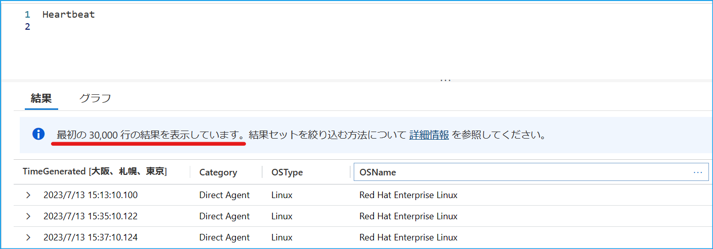
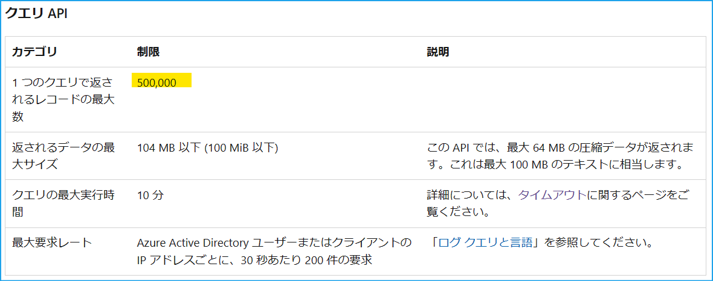
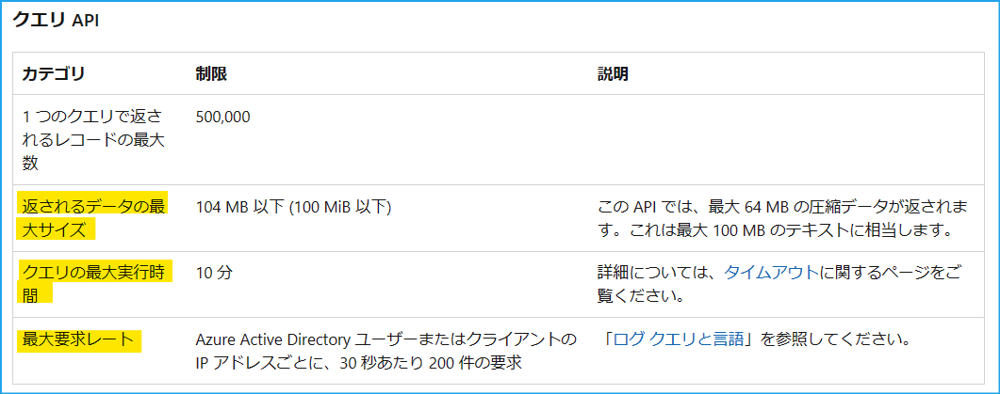
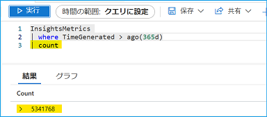

こんにちは、Azure Monitoring サポート チームの北村です。
今回は、Azure PowerShell で Log Analytics ワークスペースのログを取得する方法をご紹介します。

Azure ポータルで表示されるログ クエリの検索結果の上限は 30,000 件です。
この上限値の引き上げをご要望いただくお問い合わせをいただくことがありますが、残念ながら引き上げることはできません。
そのため、Azure ポータル からクエリを実行する必要がある場合は、時間範囲等で条件を指定いただき、検索結果を絞っていただくようご案内しております。

一方で Azure PowerShell からクエリを実行する場合、最大 500,000 行まで取得することが可能です。
そのため、今回は Azure PowerShell からクエリを実行する方法等をご紹介します！

<br>

<!-- more -->
## 目次
- [1. Azure ポータルからクエリを実行したときの上限](#1-Azure-ポータルからクエリを実行したときの上限)
- [2. Azure PowerShell からクエリを実行する方法](#2-Azure-PowerShell-からクエリを実行する方法)
- [3. Azure PowerShell によるクエリ実行の制限に触れないように工夫して実行する方法](#3-アラート処理ルールの設定手順)
- [参考情報](#参考情報)

<br>

## 1. Azure ポータルからクエリを実行したときの上限
本ブログの冒頭でもご説明したとおり、Azure ポータルで表示されるログ クエリの検索結果の上限は 30,000 件です (*1)。
この上限値を引き上げることはできません。一方で、Azure ポータル ではなく Azure PowerShell からクエリを実行の場合、500,000 行までの上限に変わります。

(*1) Azure ポータルでクエリを実行し、ログ クエリの検索結果の上限に達すると、上限に達した旨のメッセージが表示されます。


(*2) [Azure ポータルで実行したときの上限](https://learn.microsoft.com/ja-jp/azure/azure-monitor/service-limits#log-analytics-workspaces) です。


(*3) [Azure PowerShell からクエリを実行したときの上限](https://learn.microsoft.com/ja-jp/azure/azure-monitor/service-limits#log-analytics-workspaces) です。


<br>
<br>

## 2. Azure PowerShell からクエリを実行する方法
Azure PowerShell にて用意されている [Invoke-AzOperationalInsightsQuery](https://learn.microsoft.com/ja-jp/powershell/module/az.operationalinsights/invoke-azoperationalinsightsquery?view=azps-10.2.0) のコマンドレットを利用する方法がございます。
以下のサンプル スクリプトでは、Azure PowerShell よりクエリを実行し CSV ファイルに出力しています。
ワークスペース ID は Azure Portal で該当のワークスペースを開き、[概要] のページからご確認ください。

```CMD
$query = "Heartbeat | where TimeGenerated > ago(3d)"
$result = Invoke-AzOperationalInsightsQuery -WorkspaceId "<ワークスペース ID>" -Query $query
$result.Results | ConvertTo-Csv > <出力ファイル パス>
```

<br>

ただし、Azure PowerShell でクエリを実行する場合も、取得するデータのサイズやクエリの実行時間等の制限がございます (*4)。
そのため、必ず 500,000 件のレコードが取得可能であるということではない点、ご留意ください。
以下の上限にも抵触し、全量のログを取得できなかった場合には、時間範囲や条件を細かく指定していただき、クエリを実行いただく必要がございます。

(*4) [Azure PowerShell からクエリを実行したときの上限](https://learn.microsoft.com/ja-jp/azure/azure-monitor/service-limits#log-analytics-workspaces) です。



取得しようとしたデータのサイズが上限に達している場合、以下のとおりエラーが出力されます。
例えば、Invoke-AzOperationalInsightsQuery の結果を $result 変数に保存した場合、$result.Error に PartialError が記録されます。全量のログを取得できているかどうかを確認されたい場合は、以下のメッセージをご確認ください。


なお、レコード数の条件に達している場合は、エラーが出力されません。
そのため、[count](https://learn.microsoft.com/ja-jp/azure/data-explorer/kusto/query/countoperator) 演算子で取得するログのレコード数を出力させ、全量のログを取得できているかどうかをご確認ください。


<br>

> [!NOTE]
> サンプル スクリプトを実行するには、Azure PowerShell をインストールしていただく必要がございます。
> Azure PowerShell をインストール方法は [弊社公開情報](https://learn.microsoft.com/ja-jp/powershell/azure/install-azure-powershell?view=azps-10.2.0&viewFallbackFrom=azps-8.1.0) をご欄ください。
> なお、Azure PowerShell や Azure CLI を使用する際には Azure Cloud Shell が便利です。
> ポータルでログインしているユーザーの認証情報が引き継がれるため、Connect-AzAccount コマンド等の実行は不要です。
> [弊社公開情報](https://learn.microsoft.com/ja-JP/azure/cloud-shell/overview) にも利用方法を掲載しておりますので、ご覧いただけますと幸いです。


<br>


## 3. Azure PowerShell で上限に触れないように工夫して実行する方法
クエリ実行の上限に抵触せずに、繰り返しデータを取得する方法の一例をご紹介します。
この方法は、レコード数で分割してログを取得します。
クエリで取得したデータの推定データ サイズは [estimate_data_size](https://learn.microsoft.com/ja-JP/azure/data-explorer/kusto/query/estimate-data-sizefunction) で確認することが可能です。
例えば、以下のクエリでは、過去 31 日間の Syslog レコードの最大、最小、平均データ サイズを確認できます。

```CMD
Syslog
| where Facility == 'cron'
| where TimeGenerated between (datetime(2023-08-01 00:00:00) .. 31d)
| summarize max(estimate_data_size(*)), min(estimate_data_size(*)), avg(estimate_data_size(*))
```

<br>

弊社検証環境では、上記に該当するレコードの最小サイズが 328 バイト、最大サイズが 431 バイト、平均が 395 バイトでした。
つまり、全てのレコードが 431 バイトであったとしても、100,000 行で 43 MB ですので、データの最大サイズの上限 (64MB) には達しません。そのため、[top 演算子](https://learn.microsoft.com/ja-jp/azure/data-explorer/kusto/query/topoperator) を利用して 100,000 行ずつデータを取得します。top 演算子では、指定した列で並べ替えられた、先頭の N 個のレコードを返します。

<br>

```CMD
1 回目のクエリ (最初の 100,000 行を出力) :
$query = "Syslog | where TimeGenerated between(datetime(2023-08-01) .. 1d) | where Facility == 'cron' | top 100000 by TimeGenerated asc | top 100000 by TimeGenerated desc"

2 回目のクエリ (100,001 行目から 200,000 行目を出力) :
$query = "Syslog | where TimeGenerated between(datetime(2023-08-01) .. 1d) | where Facility == 'cron' | top 200000 by TimeGenerated asc | top 100000 by TimeGenerated desc"

3 回目のクエリ (200,001 行目から 300,000 行目を出力) :
$query = "Syslog | where TimeGenerated between(datetime(2023-08-01) .. 1d) | where Facility == 'cron' | top 300000 by TimeGenerated asc | top 100000 by TimeGenerated desc"
```

<br>

この方法は、データの推定データ サイズからクエリの制限に触れないようにレコード数で分割する方法です。
そのため、レコードのデータ サイズが大きく異なるテーブルの場合は、上記の方法が効率的でない場合がございます。予めご了承ください。

<br>

## 参考情報
- Azure Monitor でログ クエリの使用を開始する
https://learn.microsoft.com/ja-jp/azure/azure-monitor/logs/get-started-queries

- チュートリアル: 一般的な演算子について学習する
https://learn.microsoft.com/ja-jp/azure/data-explorer/kusto/query/tutorials/learn-common-operators#advanced-aggregations