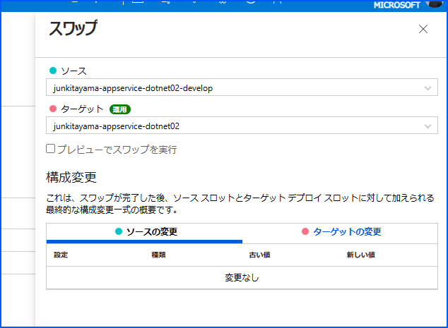
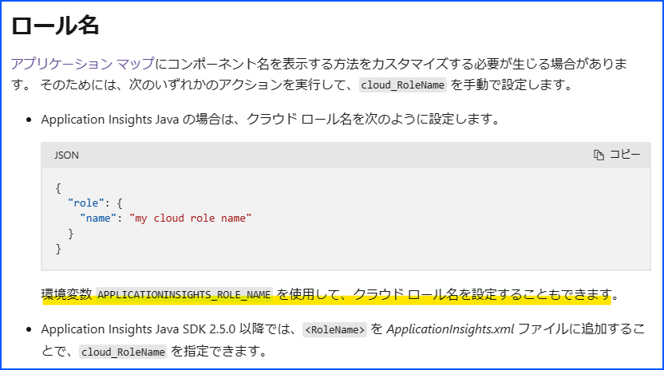

[更新履歴]  
- 12/22 22:00 (日本時間) ブログ公開

こんにちは、Azure Monitoring サポート チームの北山です。 
App Service に対してデプロイ スロットをスワップした後に、Application Insights の cloud_RoleName が期待しない値となる事象について案内いたします。

# 目次
- [目次](#目次)
- [事象について](#事象について)
- [問題の回避方法](#問題の回避方法)
- [最後に](#最後に)

# 事象について
App Service の Web アプリケーションを Application Insights で監視している場合、Application Insights に関連するログ テーブルの cloud_RoleName には、当該 Web サイト URL のホスト名が記録されます。
> xxxx-appservice.azurewebsites.net の場合は、"xxxx-appservice" が既定で cloud_RoleName の値として記録されます。

App Service に対してデプロイ スロットのスワップを実行すると、例えば本番環境とテスト環境の入れ替えが可能です。
デプロイ スロットのスワップ後に、本番環境にアクセスをしているのにも関わらずテスト環境のホスト名が Application Insights の cloud_RoleName に記録される事象を確認しています。

例えば下図のようにスワップした場合、本番環境にアクセスしているのにも関わらず cloud_RoleName に "junkitayama-appservice-dotnet02-develop" が記録されます。  
※ 本番環境にアクセスしているので、本来は "junkitayama-appservice-dotnet02" が cloud_RoleName に記録される事を期待している。

なお、こちらは弊社開発部門にて対処を検討しておりますが、発生条件が一律ではなくすぐに解消することが難しい状況です。  
ご迷惑をおかけいたしますが、問題解消までもうしばらくお時間をいただけますと幸いです。

# 問題の回避方法
App Service の運用スロット側の [設定] > [構成] の [アプリケーション設定] から、以下のアプリケーション設定を追加します。

- 設定名 : APPLICATIONINSIGHTS_ROLE_NAME
- 設定値 : cloud_RoleName に指定したい文字列
- デプロイ スロットの設定 : チェックを入れます。

環境変数 APPLICATIONINSIGHTS_ROLE_NAME を指定いただく事で、明示的に cloud_RoleName の値を指定することが可能です。  
そのため、もしデプロイ スロットのスワップにより cloud_RoleName が変わってしまう可能性を懸念される場合は、APPLICATIONINSIGHTS_ROLE_NAME の指定をご検討くださいませ。

> App Service に対してアプリケーション設定を構築すると、App Service に対して再起動が実施されます。  

- [分散トレースとテレメトリの相関関係](https://learn.microsoft.com/ja-jp/azure/azure-monitor/app/distributed-trace-data#role-names)  

# 最後に
もし、本ブログに記載の内容以外について追加のご質問やご不明点がございましたら、大変お手数ではございますが、事象を受けたサブスクリプションからお問い合わせをご発行ください。  

改めまして、本事象でご迷惑をおかけし大変申し訳ございません。

