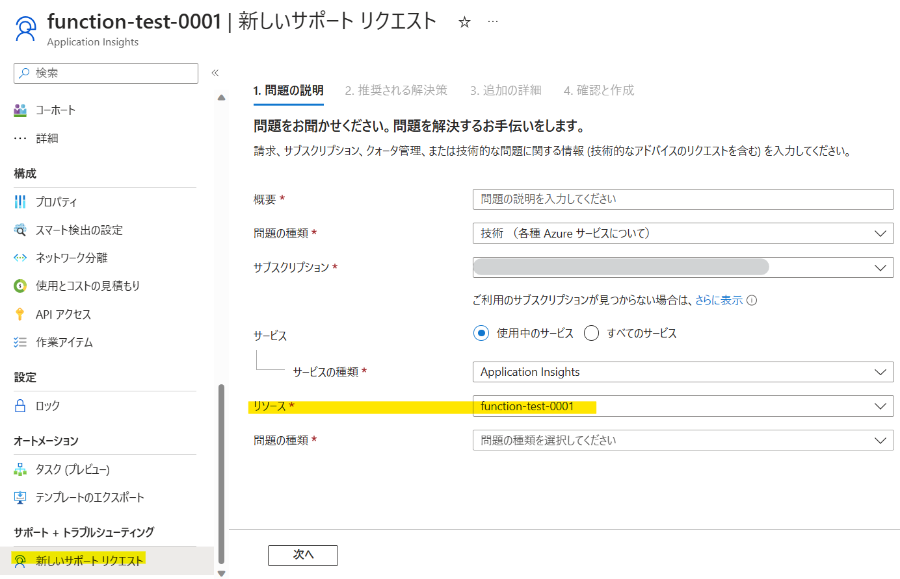
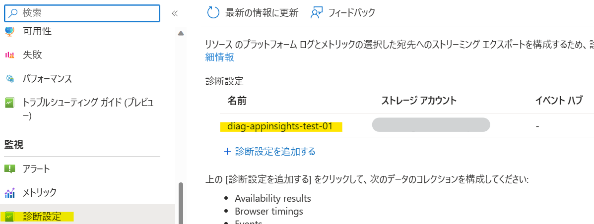

こんにちは、Azure Monitoring サポート チームの北村です。
今回は、Azure Monitor 製品のお問い合わせを発行いただく際のポイントをご紹介いたします。

大変有難いことに、たくさんのお客様に Azure Monitor 製品をご利用いただいており、日々さまざまなお問い合わせをいただいております。本記事では、お問い合わせ内容の例文や、よくあるお問い合わせを例に、弊社よりヒアリングさせていただく主な情報をご紹介いたします。今回ご紹介するポイントをふまえてお問い合わせを発行いただきますと、よりスムーズな調査が可能となります。

なお、本記事では、以下のようなお客様にお読みいただくことを想定しております。
- Azure Monitor 製品のお問い合わせを発行するときに、どのような情報が必要なのか知りたい
- Azure Monitor サポートを利用する際にどのような情報を提供すれば、効率的に成果が得られるか知りたい

Azure Monitor サポートを利用する際にどのような情報を記載すればいいの？ どのような情報が必要なの？といった疑問をお持ちの方に、少しでもご参考になれば幸いです！

 

<!-- more -->
## 目次
- [1. はじめに](#1-はじめに)
- [2. トラブルシューティング系のお問い合わせに関するポイント](#2-トラブルシューティング系のお問い合わせに関するポイント)
- [3. トラブルシューティング系のお問い合わせの例文](#3-トラブルシューティング系のお問い合わせの例文)
- [4. トラブルシューティング系のお問い合わせで必要な情報](#4-トラブルシューティング系のお問い合わせで必要な情報)
  - [4-1. Azure Monitor エージェント (または Log Analytics エージェント) でログを収集できない](#4-1-Azure-Monitor-エージェント-または-Log-Analytics-エージェント-でログを収集できない)
  - [4-2. Azure Monitor エージェント (または Log Analytics エージェント) がインストールできない、アンインストールできない](#4-2-Azure-Monitor-エージェント-または-Log-Analytics-エージェント-がインストールできない、アンインストールできない)
  - [4-3. アラート ルールが想定どおりに動作しない（検知もれ）](#4-3-アラート-ルールが想定どおりに動作しない-検知もれ)
  - [4-4. アラート ルールが想定どおりに動作しない（誤検知）](#4-4-アラート-ルールが想定どおりに動作しない-誤検知)
  - [4-5. アラートが発報したが、メールで通知されない](#4-5-アラートが発報したが、メールで通知されない)
  - [4-6. アラート処理ルールが想定どおりに動作しない](#4-6-アラート処理ルールが想定どおりに動作しない)
  - [4-7. Azure Monitor の診断設定によるログが出力されない](#4-7-Azure-Monitor-の診断設定によるログが出力されない)
- [5. トラブルシューティング系以外のお問い合わせに関するポイント](#5-トラブルシューティング系以外のお問い合わせに関するポイント)
- [6. 最後に](#6-さいごに)

 

## 1. はじめに
弊社サポートまでお寄せいただくお問い合わせは、主に [トラブルシューティング系] と [How-To 系] に大別できます。
前者の場合、Azure Monitor エージェントでログが収集されない、ログ アラート ルールでアラートが検知されなかった、といった、トラブル系のお問い合わせです。後者の場合、Azure Monitor エージェントのネットワーク要件が知りたい、ログ アラート ルールの設定手順が知りたい、といった、製品の利用方法に関する内容です。

How-To 系のお問い合わせの場合は、弊社公開情報をご案内したり、弊社内で検証の上、回答をご案内しております。
一方で、トラブルシューティング系の場合は、お客様環境にて発生している事象を正確に把握させていただくため、
事象内容を詳細にヒアリングさせていただき、場合によっては、お客様環境にてログ採取をお願いすることもございます。

本記事では、よくある [トラブルシューティング系] のお問い合わせを例に、ヒアリングさせていただく情報をご紹介いたします。
また、[How-To 系] のお問い合わせを発行いただく際のポイントもお伝えします。
お問い合わせを発行いただく際には、今回ご紹介する情報をお寄せいただけますと幸いです！
※ 事象によっては、本記事に掲載していない情報もヒアリングさせていただく場合もございます。予めご了承ください。

 

## 2. トラブルシューティング系のお問い合わせに関するポイント
トラブルシューティング系のお問い合わせを発行する際のポイントは、主に 3 つです。
例えば 「仮想マシンのログが収集できないため、原因を教えてほしい」 等と、お問い合わせ内容が省略されて記載されている場合、事象の確認にお時間を要します。以下のポイントをふまえて記載いただくことで、結果的に課題解決を早めることに繋がります。

 

#### ★1. お問い合わせのゴールを明記していただくこと
#### ★2. 調査対象リソースを明記いただくこと
#### ★3. 現在の状況と問題に至るまでの経緯を正確に共有いただくこと

 

エラーや不具合が発生した場合は、以下のポイントをふまえて、情報をお寄せください。
発生している問題やご状況を詳細にご説明いただけますと、解決に要する時間を短縮することができます。
また、問題が発生しているリソースをご共有いただけますと、弊社からリソースの状態や基盤側のログを確認することができます。

 

#### ★1. お問い合わせのゴールを明記していただくこと
- お問い合わせで解決したいことを明確に記載してください。
- 原因調査をご希望される場合は、その旨明記してください。
- 原因調査よりも事象の復旧を優先される場合は、その旨明記してください。
- 複数の問題が発生している場合において、優先的に解決されたい事象がある場合は、その旨お知らせください。
- お客様のスケジュールにおいて回答期日があれば、その日付とその理由、および万が一にその日付を過ぎてしまった場合の業務影響の詳細をお知らせください。 速やかに回答させていただくよう心がけておりますが、弊社内の開発部門に対してお客様のスケジュール状況を伝えさせていただくことで、優先度を上げた調査が期待できます。

 

#### ★2. 調査対象リソースを明記いただくこと
- 事象が発生しているリソース ID をご連絡ください。
- 調査対象リソースのページの [新しいサポート リクエスト] をクリックし、リソースを選択してください (※1)。
- 調査対象リソースが複数存在する場合は、調査対象リソースの [概要] - [JSONビュー] からリソース ID をご確認ください (※2)。

※1 調査対象リソースのページの [新しいサポート リクエスト] をクリックしますと、自動でリソースが選択されます。

※2 リソースの [概要] ページの一例です。

 

> [!IMPORTANT]
> 異なるサブスクリプション上のリソースの調査について
> お問い合わせを発行いただく際、調査対象リソースのサブスクリプションからお問い合わせ下さいますよう、お願いいたします。異なるサブスクリプション上のリソースの調査は、セキュリティ上の問題が発生します。詳細は以下ブログをご覧ください。
>
>
> お問い合わせ発行時と「異なる」サブスクリプションの調査依頼に対してのセキュリティ チェックが強化されます
> https://jpaztech.github.io/blog/information/Different-subscriptions-research/
> 電話経由における Azure サブスクリプションの調査のセキュリティ チェックが厳格化されます
> https://jpaztech.github.io/blog/information/Security-check-stricter/

> [!IMPORTANT]
> 高度な診断情報について
> お問い合わせによっては、高度な診断情報の確認が必要な場合がございます。
> お問い合わせを発行する際に [高度な診断情報の収集を許可しますか] を [はい] にご設定いただきますと、Azure サポートで Azure リソースから高度な診断情報を収集できるようになり、お客様にて手動で情報採取を実施いただき、弊社サポートまでご連携いただく、といった作業が減ります。基本的には、こちらで「はい」を選択していただくことをお勧めしております。
>
>
> 当社が Azure サポートの提供のために使用するデータ
> https://azure.microsoft.com/ja-jp/support/legal/support-diagnostic-information-collection/
> Azure サポート要求を作成する > 追加情報
> https://learn.microsoft.com/ja-jp/azure/azure-portal/supportability/how-to-create-azure-support-request#additional-details

 

#### ★3. 発生している問題とその経緯を正確に共有いただくこと
- 発生している問題を正確に記載してください。
- 事象発生時刻は、タイムゾーンを明記してご記載ください（例. 2023-03-15 12:00 JST, 2023-04-20 10:00 UTC）。
- 問題の切り分け作業を実施された場合は、実施した内容を明記してください。
- 事象が再現する場合は、その再現手順を記載してください。
- エラー メッセージは、テキストと画面キャプチャでお寄せください。
- 事象発生前後で実施された作業がある場合は、どのような情報でも構いませんので、ご一報ください。

 

## 3. トラブルシューティング系のお問い合わせの例文
よくあるトラブルシューティングケースを参考に、お問い合わせ内容の例文をご紹介します。
お客様環境で発生している問題をスピーディーに解決するためにも、ご紹介したポイントをおさえて、情報をご共有いただけますと幸いです。

**例 1. Azure Monitor エージェントでログを収集できない**
> ■ 本お問い合わせで解決したいこと (★1)
> 仮想マシン VM01 にて、Azure Monitor エージェントで Heartbeat, Syslog, Perf を収集できるようにしたい。
>
> ■ 調査対象リソース (★2)
> 仮想マシン (REHL 8.7)       : /subscriptions/xxx/resourceGroups/xxx/providers/Microsoft.Compute/virtualMachines/VM01
> データ収集ルール             : /subscriptions/xxx/resourceGroups/xxx/providers/Microsoft.Insights/dataCollectionRules/DCR01
> Log Analytics ワークスペース : /subscriptions/xxx/resourcegroups/xxx/providers/microsoft.operationalinsights/workspaces/LAWS01
>
> ■ 実施したこと (★3)
> 2023 年 3 月 20 日 12:00 JST に、Azure ポータルから Syslog と Perf を収集するためのデータ収集ルール DCR01 を作成した。
> 当該データ収集ルールに仮想マシン VM01 を紐づけた。
>
> ■ 状況 (★3)
> 2023 年 3 月 21 日 12:00 JST 時点で、対象マシンのログ収集先 LAWS01 に、当該マシンの Heartbeat, Syslog, Perf が収集できていない。
> なお、対象マシンはプロキシ経由でインターネット接続を実施している。
>
> ■ 確認したこと (★3)
> ・Azure ポータルの [拡張機能とアプリケーション]より、対象マシンに Azure Monitor エージェントがインストールされ、拡張機能の状態が Provisioning succeeded となっていること
> ・Log Analytics ワークスペース LAWS01 上にて、Heartbeat, Perf, Syslog のクエリを実行し、ログが収集されていないこと

 

**例 2. アラート ルールが発報しなかった**
> ■ 確認したいこと (★1)
> 死活監視アラート Heartbeat-Alert-01 が発報しなかった原因
>
> ■ 発生した問題 (★3)
> 仮想マシン VM01 を監視している死活監視アラート Heartbeat-Alert-01 の検知漏れ
>
> ■ 調査対象リソース (★2)
> 仮想マシン (REHL 8.7)       : /subscriptions/xxx/resourceGroups/xxx/providers/Microsoft.Compute/virtualMachines/VM01
> ログ アラート ルール         : /subscriptions/xxx/resourceGroups/xxx/providers/microsoft.insights/scheduledqueryrules/Heartbeat-Alert-01
> Log Analytics ワークスペース : /subscriptions/xxx/resourcegroups/xxx/providers/microsoft.operationalinsights/workspaces/LAWS01
>
> ■ 状況 (★3)
> 2023 年 4 月 20 日 15:00 JST ～ 2023 念 4 月 20 日 16:00 JST の間、対象マシンの Heartbeat が途絶えていた。
> ログ アラート ルール Heartbeat-Alert-01 の評価の頻度は 5 分のため、アラートが発報することが想定されたが、一度も発報しなかった。
>
> ■ 確認したこと (★3)
> ・Azure ポータルの モニター > アラート のページより、ログ アラート ルール Heartbeat-Alert-01 が発報していないことを確認

 

## 4. トラブルシューティング系のお問い合わせで必要な情報
よくお問い合わせをいただく内容を例に、ヒアリングさせていただく情報を紹介します。
お問い合わせを起票いただく際には、今回ご紹介した例文をご参考に、以下の情報をお寄せください。

 

### 4-1. Azure Monitor エージェント (または Log Analytics エージェント) でログを収集できない
例. Windows Server 2016 に Azure Monitor エージェントを導入しているが、Perf が収集されない

主に以下の情報をヒアリングさせていただき、必要に応じてログ採取を依頼させていただきます。

- 対象 VM のリソース ID
- ログを収集している Log Analytics ワークスペースのリソース ID
- ログの収集が停止された日時 (タイムゾーンを明記してご記載ください。例. 2023-03-15 12:00 JST)
- 収集できていないログのテーブル名 (すべてのログが収集されていない or 一部のログが収集されていない)
- データ収集ルールのリソース ID (Azure Monitor エージェントの場合のみ該当)
- 対象 VM のネットワーク環境 (例. インターネットに接続できる環境、プロキシ サーバーやファイアウォールの有無、等)

 

### 4-2. Azure Monitor エージェント (または Log Analytics エージェント) がインストールできない、アンインストールできない
例. Windows Server 2016 に Azure Monitor エージェントをインスールできない

主に以下の情報をヒアリングさせていただき、必要に応じてログ採取を依頼させていただきます。
エージェントのインストール、アンインストール時に出力されたメッセージは、画面キャプチャやテキスト情報でお寄せいただけますと幸いです。

- 対象 VM のリソース ID
- 実施されたインストール、または、アンインストール手順 (例. Azure ポータルの XX の画面よりインストールした、等)
- 対象 VM のネットワーク環境 (例. インターネットに接続できる環境、プロキシ サーバーやファイアウォールの有無、等)
- 出力されたエラーメッセージ

 

<!-- AME 系 -->
### 4-3. アラート ルールが想定どおりに動作しない (検知もれ)
例. アラートの発報条件に抵触していたのに、アラートが発報されなかった

- アラート ルールのリソース ID
- アラートが発報されることが想定された日時 (タイムゾーンを明記してご記載ください。例. 2023-03-15 12:00 JST)

 

### 4-4. アラート ルールが想定どおりに動作しない (誤検知)
例. アラートの発報条件に抵触していないのに、アラートが発報した

アラートの通知をメールで受領されている場合は、以下の情報がメールに記載されております。
Azure ポータルからお問い合わせを起票いただく場合は、[ファイルをアップロードすることが可能](https://learn.microsoft.com/ja-jp/azure/azure-portal/supportability/how-to-create-azure-support-request#additional-details)ですので、
受領されたメール ファイルをご共有いただくことでも問題ございません。

- アラート ルールのリソース ID
- アラートが発報された日時 (タイムゾーンを明記してご記載ください。例. 2023-03-15 12:00 JST)
- アラート ID

アラート ID は [モニター] - [アラート] より、対象のアラートをクリックし、画面下部に表示された [Alert ID] をご共有ください。

 

### 4-5. アラートが発報したが、メールで通知されない
例. アラートが発報したが、アクション グループによるメールが通知されない

- アラート ルールのリソース ID
- アラート ルールに紐づかれているアクション グループのリソース ID
- アラートが発報した日時 (タイムゾーンを明記してご記載ください。例. 2023-03-15 12:00 JST)
- アラート ID

 

### 4-6. アラート処理ルールが想定どおりに動作しない
例. アラートの通知を抑制している時間帯にメールが通知された

- アラート処理ルールのリソース ID
- アラート ルールのリソース ID
- アクション グループにて通知された日時 (タイムゾーンを明記してご記載ください。例. 2023-03-15 12:00 JST)
- アラート ID

 

### 4-7. Azure Monitor の診断設定によるログが出力されない
例. Automation アカウントの診断設定で、ジョブに関するログが Log Analytics ワークスペースに収集されていない

- 診断設定の名前
- 診断設定を構成されているリソースのリソース ID (上記例の場合、Automation アカウントのリソース ID)
- ログ収集先 (Log Analytics ワークスペース、ストレージ アカウント等) のリソース ID
- ご確認の際に実行された実際のログ クエリ (ログ収集先が Log Analytics ワークスペースの場合)

診断設定の名前は 各リソースの [診断設定] よりご確認いただけます。

 

## 5. トラブルシューティング系以外のお問い合わせに関するポイント
トラブルシューティング系以外のお問い合わせですと、例えば、以下のような How-To 系のお問い合わせが考えられます。

- Azure Monitor エージェントをインストールする方法が分からない
- ログ アラート ルールの作成手順が分からない
- アラート ルールの設定項目である XXX の意味が知りたい
- アラート発報履歴の保存期間を伸ばす方法を知りたい
- メトリック アラート ルールの評価頻度を 1 分より短くする方法が知りたい

上記のようなお問い合わせの場合は、以下の情報をご連絡いただけますと幸いです。
まず、ご確認いただいた資料を共有いただくことで、お客様の目線に合わせたご支援が可能となります。
また、具体的に実現されたいご要件や前提条件を共有いただくことで、根本的な課題を解決するための別のソリューションをご案内できる可能性がございます。
さらに、具体的なご質問の背景を共有いただくことで、適切な情報の提供が可能であったり、弊社関連部署と連携して調査する際にスムーズにコミュニケーションが図れる可能性がございます。
以下のような情報をご連携いただくことで、結果として、課題解決を早めることが可能となります。

##### ★1. ご参照された弊社公開情報のリンク (弊社公開情報以外でも構いません)
##### ★2. お客様が実現されたいご要件・前提条件
##### ★3. ご質問の背景や、お問い合わせに至るまでの経緯 (なぜ知る必要があるか、なぜ Azure Monitor の仕様についてご質問されたのか。など)
##### ★4. お客様のスケジュールにおいて回答期日があれば、その日付とその理由、および万が一にその日付を過ぎてしまった場合の業務影響の詳細

 

## 6. さいごに
今回は、Azure Monitor 製品のお問い合わせを発行いただく際のポイントをご紹介するとともに、お問い合わせの例文や弊社よりヒアリングさせていただく情報をご紹介いたしました。今回ご紹介した事例に該当しない事象やご要望等ございましたら、まずはその旨、お問い合わせいただき、担当エンジニアまでご相談ください。

最後になりましたが、弊社 Azure Monitor サポートチームでは、お客様のご不明な点や問題を解消するため、チーム一丸となり、ご支援させていただきます。より良いサービスをご提供すべく、尽力させていただきますので、何かお困りごとがございましたら、いつでもお気軽にお問い合わせください。

最後までお読みいただきありがとうございました！